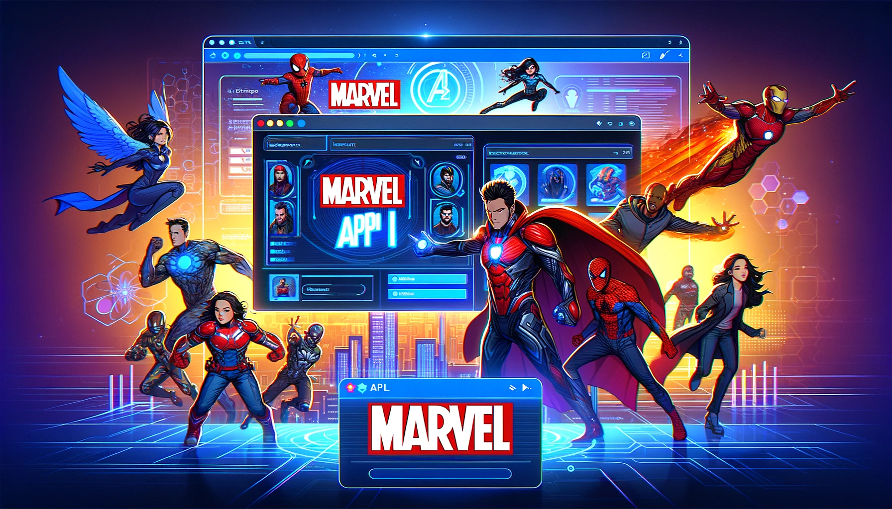

# Documentación del Proyecto Marvel API - UnProgramadorNace

## Descripción
Este proyecto **tiene como objetivo mostrar cómo se evaluan las habilidades de un desarrollador en la implementación de APIs, el manejo de bases de datos y la autenticación de usuarios** y este proyecto es una aplicación que interactúa con la API de Marvel para obtener información sobre personajes y cómics. A continuación, se proporciona una descripción general de las principales componentes y funcionalidades del proyecto.

## Características
El proyecto de prueba técnica para desarrollador backend consiste en el desarrollo de una API **con tecnología Java utilizando el framework Spring Boot**. Esta API tiene como objetivo consumir la API de Marvel, cuya documentación se encuentra en **[este enlace](https://developer.marvel.com/)**. A continuación, se detallan las principales características de este proyecto:

1. **Consumo de la API de Marvel**: La aplicación desarrollada se encarga de consumir la API de Marvel, obteniendo información relevante sobre personajes, cómics, series y más.

2. **Almacenamiento en Base de Datos**: Se implementa un esquema de base de datos, preferiblemente MySQL, para almacenar toda la información necesaria. Esto incluye datos relacionados con personajes, cómics y series.

3. **API de Suministro de Información**: Se crea una API que ofrece diversas funcionalidades para obtener información de Marvel, incluyendo:
    - Búsqueda de personajes de Marvel por nombre, historietas y series.
    - Obtención del listado de cómics asociados a un personaje específico.
    - Acceso a la imagen y descripción de un personaje en particular.
    - Listado completo de cómics disponibles.
    - Filtrado de cómics por identificador.
    - Visualización de búsquedas relacionadas a historietas realizadas por cualquier usuario.
    - Registro de búsquedas específicas de un usuario particular.

5. **Autenticación con Spring Security**: La API implementa un medio y esquema de autenticación utilizando Spring Security. Esto permite identificar qué usuario está realizando búsquedas de información de Marvel.

## Configuración
Antes de ejecutar la aplicación, es necesario configurar las siguientes propiedades en el archivo `application.properties`:

```properties
integration.marvel.key.public=<Tu clave pública de Marvel>
integration.marvel.key.private=<Tu clave privada de Marvel>
```
Asegúrate de obtener estas claves de la API de Marvel ([click para obtener](https://developer.marvel.com/)) y reemplazar `<Tu clave pública de Marvel>` y `<Tu clave privada de Marvel>` con tus propias claves.


Además se debe de configurar en el archivo application-dev.properties las propiedades correspondientes para MySQL:
```properties
spring.datasource.url=jdbc:mysql://<Tu host>:<Tu puerto>/<Tu base de datos>
spring.datasource.username=<Tu username>
spring.datasource.password=<Tu password>
spring.datasource.driver-class-name=com.mysql.cj.jdbc.Driver
```

## Paquetes del Proyecto
El proyecto está organizado en los siguientes paquetes:

- `com.api.marvel.advice`: Contiene clases para capturar errores de la aplicacion devolverlos como respuesta.
- `com.api.marvel.config`: Contiene configuraciones de seguridad, autenticación y validaciones.
- `com.api.marvel.controller`: Contiene clases DTO para toda la aplicacion, controladores e interceptores.
- `com.api.marvel.exception`: Incluye clases relacionadas con excepciones personalizadas.
- `com.api.marvel.mapper`: Contiene mapeadores para convertir entre entidades y DTO.
- `com.api.marvel.persistence`: Define entidades de la base de datos, conexion con Marvel y con la base de datos.
- `com.api.marvel.service`: Define la logica de negocio de la aplicacion y es un puente para conectarse con la capa de persistencia.
- `com.api.marvel.util`: Ofrece utilidades genéricas.

## Clases Principales
A continuación, se describen algunas de las clases principales del proyecto:

### `ApiMarvelConfig`
- Clase de configuración que se encarga de proporcionar la clave pública y privada de Marvel y gestionar la autenticación en las solicitudes a la API de Marvel.

### `ComicRepository`
- Repositorio que interactúa con la API de Marvel para obtener información sobre cómics. Proporciona métodos para buscar cómics relacionados con personajes y buscar cómics por ID.

### `CharacterRepository`
- Repositorio que se conecta a la API de Marvel para obtener información sobre personajes. Contiene métodos para buscar personajes por criterios y obtener información detallada de un personaje por ID.

### `JwtUtils`
- Servicio para la generación y validación de tokens JWT. Utilizado para la autenticación en la aplicación.

### `CharacterServiceImpl` y `ComicServiceImpl`
- Interfaces de servicio que definen operaciones relacionadas con cómics y personajes. Sus implementaciones se encuentran en `ComicServiceImpl` y `CharacterServiceImpl`, respectivamente.

### Controladores
- Los controladores, como `CharacterController`, `ComicController`, y `AuthController`, gestionan las solicitudes HTTP y responden con datos a los clientes.

### Filtros e Interceptores
- Los filtros e interceptores, como `JwtTokenValidator` y `UserInteractionInterceptor`, agregan funcionalidad de seguridad y registro a la aplicación.

### `HistoryServiceImpl` y Repositorio
- La entidad `UserInteractionLog` y su repositorio gestionan los registros de las interacciones de los usuarios con la aplicación.

## Manejo de Excepciones
El proyecto incluye un sistema de manejo de excepciones que garantiza una respuesta adecuada a diferentes tipos de errores, como errores de autenticación y errores en las solicitudes a la API de Marvel. El manejo de excepciones se realiza a través de la clase HandlerErrorAdvice.

## Properties

``` Properties
spring.jpa.hibernate.ddl-auto=create-drop
```

## Spring Security: Usuarios y Roles
Los scripts incluyen la creación de dos roles y dos usuarios. Estos roles son **"USER" y "ADMIN"** y los dos usuarios son **"juan" y "santiago" con las contraseñas "1234"** respectivamente.
Los permisos del role **"ADMIN"** son:
- READ_COMIC
- READ_CHARACTER
- CREATE_USER
- INVALID_USER

Los permisos del role **"USER"** son:
- READ_CHARACTER
- READ_COMIC

## Resumen
Este documento proporciona una visión general de la estructura del proyecto, sus componentes clave y cómo configurar las claves de la API de Marvel. Asegúrate de configurar correctamente las claves antes de ejecutar la aplicación para que funcione correctamente.
